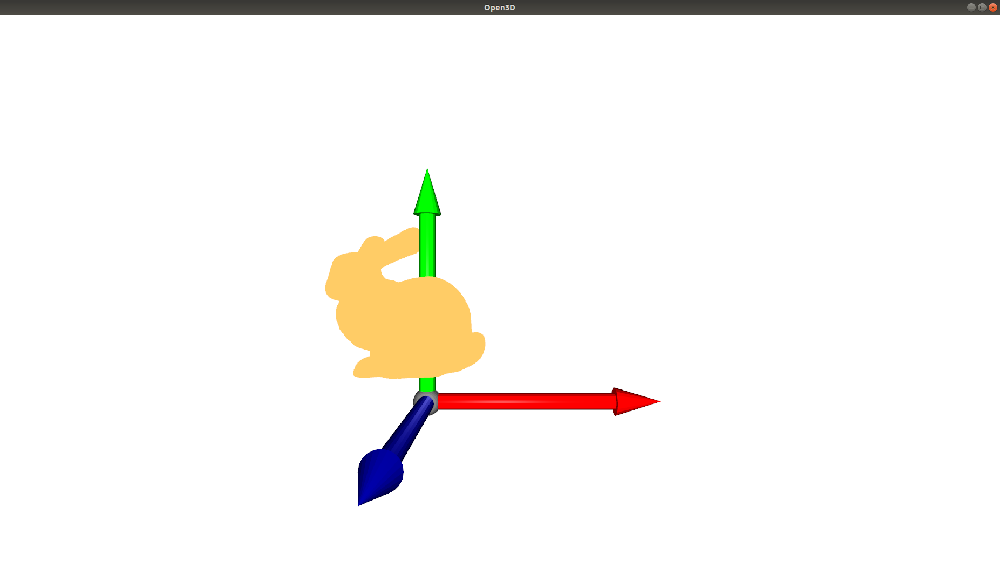
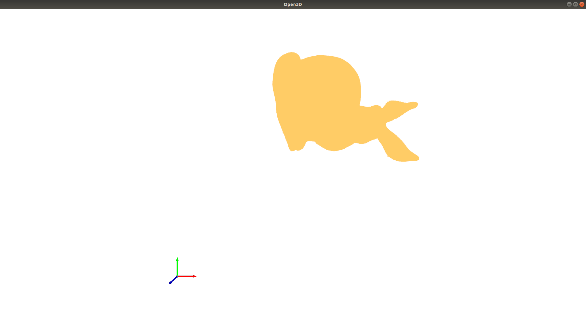

# Transformations and representations


# 1. Getting started with Open3D

Open3D is an open-source library that deals with 3D data, such as point clouds, mesh. We'll be using Open3D frequently as we work with point clouds. Let's start with something simple:


1. Read the Stanford Bunny file (in `data/`) given to you and visualise it using Open3D.
2. Convert the mesh to a point cloud and change the colour of points.
3. Set a predefined viewing angle (using Open3D) for visualization and display the axes while plotting.
4. Scale, Transform, and Rotate the rabbit (visualise after each step).
5. Save the point cloud as bunny.pcd.


<b>scaled:</b>

<b>transformed:</b>

# Transformations and Representations

## a) Euler angles
1. Write a function that returns a rotation matrix given the angles $\alpha$, $\beta$, and $\gamma$ in radians (X-Y-Z)

2. Solve for angles using ```fsolve from scipy``` for three initializations of your choice and compare.
$$M(\alpha , \beta ,\gamma)=\left[\begin{array}{rrr}0.26200263 & -0.19674724 & 0.944799 \\0.21984631 & 0.96542533 & 0.14007684 \\
    -0.93969262 & 0.17101007 & 0.29619813\end{array}\right] 
$$

$$N(\alpha , \beta ,\gamma)=\left[\begin{array}{rrr}0 & -0.173648178 &  0.984807753 \\0 & 0.984807753 & 0.173648178 \\
    -1 & 0 & 0\end{array}\right] 
$$

3. What is a Gimbal lock? 

4. Show an example where a Gimbal lock occurs and visualize the Gimbal lock on the given bunny point cloud. You have to show the above by **animation** (cube rotating along each axis one by one).
    - *Hint: Use Open3D's non-blocking visualization and discretize the rotation to simulate the animation. For example, if you want to rotate by $30^{\circ}$ around a particular axis, do in increments of $5^{\circ}$ 6 times to make it look like an animation.*


<b> Explanation: </b>We see that the angles produced by fsolve is correct as the inverse conversion of Euler X-Y-Z angles produces same M and N rotational matrices provided in the question

3. Gimbal lock is when there is 1-DOF loss in a 3D mechanism  due to 2 out of 3 axes driven into parallel configuration. Due to the parallel configuration, there isnt any rotation along about one of the axis

4. Our goal is to show gymbal lock occurring due to euler rotations. We are doing X-Y-Z euler rotations in that order. Therefore we see that a simple example where gymbal lock occurs is when we rotate about Y by 90 degrees.
Lets say, we rotate about X by alpha degrees and rotate about Y by 90 degrees OR we rotate about Y by 90 degrees and then rotate about Z by negative alpha degrees.
In both cases the transform is the same. This is because when we rotate about Y by 90 degrees, our original Z axis coincides now with the original X axis with the . Therefore whatever angle of rotation we did during the X part of the X-Y-Z rotation can be reproduced as the same rotation around Z part of X-Y-Z rotation.
Hence we are actually losing a degree of freedom by rotating around Y by 90 degrees as both X and Z rotations will finally have the same effect.

## b) Quaternions

1. What makes Quaternions popular in graphics? 
2. Convert a rotation matrix to quaternion and vice versa. Do not use inbuilt libraries for this question.
3. Perform matrix multiplication of two $\mathcal{R}_{3 \times 3}$ rotation matrices and perform the same transformation in the quaternion space. Verify if the final transformation obtained in both the cases are the same.
4. Try to interpolate any 3D model (cube / bunny / not sphere obviously!!) between two rotation matrices and visualize!

The above questions require you to **code your own functions** and **only verify** using inbuilt functions.


1. Interpolation is easily possible in quternions which is desirable in graphics. All transformations are orthonormal. It can also help in rotation about multiple axis at a time instead of doing composite matrix rotations which could lead to gimbal lock.


# Data Represenations 
## a) Octomaps

1. Why is an Octomap memory efficient?
2. When do we update an Octomap and why?
3. When would you likely use an octomap instead of a point cloud?


### Answers

1. Mappings are needed to be efficient as mpas are an integral part of automation systems for planning and navigation. Therefore,  these octomaps are required to memory-efficient to map large environments. 
2. We can add new information from sensors at any point of time as the updation is done is a probablistic manner. The updates are only done on the leaf nodes.
3. Octomaps are preferred over point clouds when we are dealing with large and dynamic regions as they are able to probablistically update multiple measurments as they are computed. Secondly, point clouds aren't memory efficient as they store large amount of points. Thirdly, octomaps are preferred when we are dealing with regions with obstaclees as they can differenciate between regions that are unmapped and regions aren don't have any obstacles.


## b) Signed Distance Functions

1. How do we determine object surfaces using SDF?
2. How do we aggregate views from multiple cameras? (just a general overview is fine)
3. Which preserves details better? Voxels or SDF? Why?
4. What’s an advantage of SDF over a point cloud?

### Answers

1. SDF(signed distance fields) are used to describe volume of an object. In a metric space, it is used to identift the distance of a given point from its boundary. They are marked by positive values inside the object and progressively decreases when moving towards the boundary and finally reaches zero, So when the SDF value is zero(zero-crossing while interpolation), we can conclude that it refers to the object surface.
<br>
2. To aggregate and update views, we fuse the infomation similar to probablity based approach. We do a weighted average where we have distance computed from a particular voxel to surface as seen from that particular camera view. This process is done for each and every voxel present in the scene.

3. SDF is better due to the following reasons: 
    a. Noise gets averaged out with multiple measurements thus giving better details
    b. We can get a sub voxel accuracy using least squares estimate
<br>
4. SDF is preferred over point cloud as it is more useful in planning as essentially store distances from surfac

## References and Resources

1. Gimbal locks and quaternions: https://youtu.be/YF5ZUlKxSgE
2. Exponential map: 
    1. 3 Blue 1 Brown: https://youtu.be/O85OWBJ2ayo
    2. Northwestern Robotics: https://youtu.be/v_KBHaG0mas
3. Bunny ply is taken from: http://graphics.im.ntu.edu.tw/~robin/courses/cg03/model/